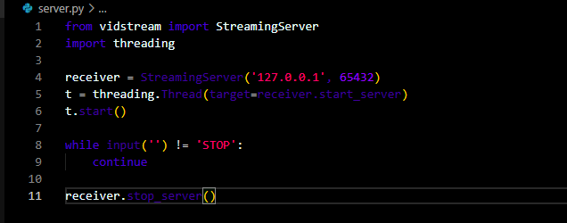
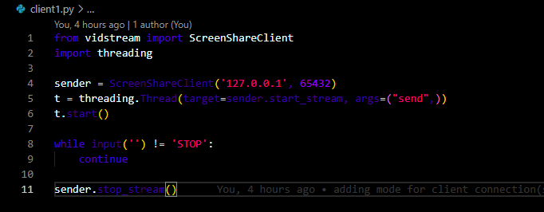
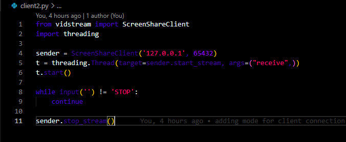

# vidstream

Under construction! Not ready for use yet! Currently experimenting and planning!

Developed by Florian Dedov from NeuralNine (c) 2020

## Examples of How To Use (Buggy Alpha Version)

Creating A Server

```python
from vidstream import StreamingServer

server = StreamingServer('127.0.0.1', 9999)
server.start_server()

# Other Code

# When You Are Done
server.stop_server()
```

Creating A Client
```python
from vidstream import CameraClient
from vidstream import VideoClient
from vidstream import ScreenShareClient

# Choose One
client1 = CameraClient('127.0.0.1', 9999)
client2 = VideoClient('127.0.0.1', 9999, 'video.mp4')
client3 = ScreenShareClient('127.0.0.1', 9999)

client1.start_stream()
client2.start_stream()
client3.start_stream()
```

# Vidstream-Updated-
### Updating Vidstream package
- Making server to handle multiple clients connection
- Server broadcast received frame to all connected clients except the one who send the frame
- The video to be displayed to the client and not server

#### Example









Check out: https://www.youtube.com/c/NeuralNine